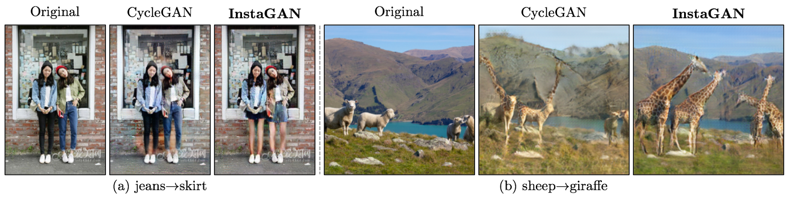
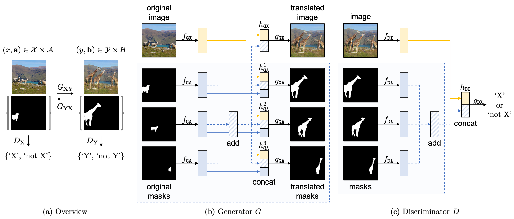
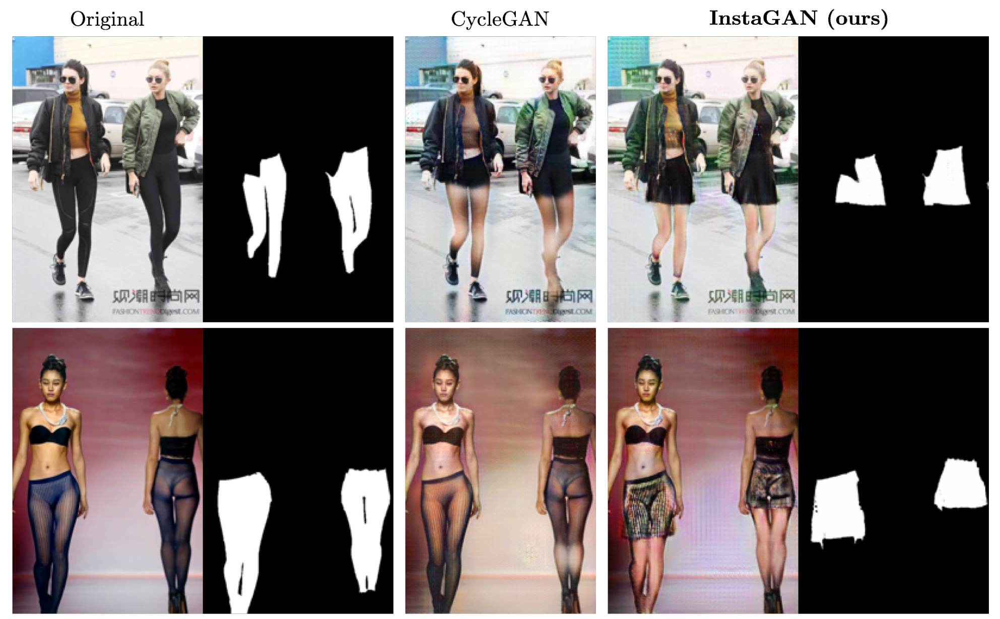
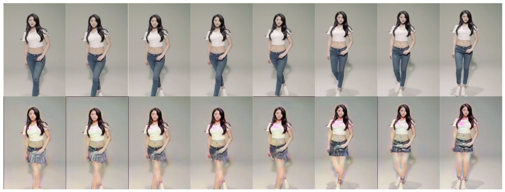

# InstaGAN: Instance-aware Image-to-Image Translation

PyTorch implementation of ["InstaGAN: Instance-aware Image-to-Image Translation"](https://openreview.net/forum?id=ryxwJhC9YX) (ICLR 2019).
The implementation is based on the [official CycleGAN](https://github.com/junyanz/pytorch-CycleGAN-and-pix2pix) code.
Our major contributions are in `./models/insta_gan_model.py` and `./models/networks.py`.






## Getting Started
### Installation

- Clone this repository
```
git clone https://github.com/sangwoomo/instagan
```

- Install PyTorch 0.4+ and torchvision from http://pytorch.org and other dependencies (e.g., [visdom](https://github.com/facebookresearch/visdom) and [dominate](https://github.com/Knio/dominate)).
You can install all the dependencies by
```
pip install -r requirements.txt
```

- For Conda users, you can use a script `./scripts/conda_deps.sh` to install PyTorch and other libraries.

- **Acknowledgment:** Installation scripts are from the [official CycleGAN](https://github.com/junyanz/pytorch-CycleGAN-and-pix2pix) code.


### Download base datasets

- Download [clothing-co-parsing (CCP)](https://github.com/bearpaw/clothing-co-parsing) dataset:
```
git clone https://github.com/bearpaw/clothing-co-parsing ./datasets/clothing-co-parsing
```

- Download [multi-human parsing (MHP)](https://lv-mhp.github.io/) dataset:
```
# Download "LV-MHP-v1" from the link and locate in ./datasets
```

- Download [MS COCO](http://cocodataset.org/) dataset:
```
./datasets/download_coco.sh
```

### Generate two-domain datasets

- Generate two-domain dataset for experiments:
```
python ./datasets/generate_ccp_dataset.py --save_root ./datasets/jeans2skirt_ccp --cat1 jeans --cat2 skirt
python ./datasets/generate_mhp_dataset.py --save_root ./datasets/pants2skirt_mhp --cat1 pants --cat2 skirt
python ./datasets/generate_coco_dataset.py --save_root ./datasets/shp2gir_coco --cat1 sheep --cat2 giraffe
```
- **Note:** Generated dataset contains images and corresponding masks, which are located in image folders (e.g., 'trainA') and mask folders (e.g., 'trainA_seg'), respectively.
For each image (e.g., '0001.png'), corresponding masks for each instance (e.g., '0001_0.png', '0001_1.png', ...) are provided.

### Run experiments

- Train a model:
```
python train.py --dataroot ./datasets/jeans2skirt_ccp --model insta_gan --name jeans2skirt_ccp_instagan --loadSizeH 330 --loadSizeW 220 --fineSizeH 300 --fineSizeW 200 --niter 400 --niter_decay 200
python train.py --dataroot ./datasets/pants2skirt_mhp --model insta_gan --name pants2skirt_mhp_instagan --loadSizeH 270 --loadSizeW 180 --fineSizeH 240 --fineSizeW 160
python train.py --dataroot ./datasets/shp2gir_coco --model insta_gan --name shp2gir_coco_instagan --loadSizeH 220 --loadSizeW 220 --fineSizeH 200 --fineSizeW 200
```

- To view training results and loss plots, run `python -m visdom.server` and click the URL http://localhost:8097.
To see more intermediate results, check out `./checkpoints/experiment_name/web/index.html`.

- For faster experiment, increase batch size and use more gpus:
```
python train.py --dataroot ./datasets/shp2gir_coco --model insta_gan --name shp2gir_coco_instagan --loadSizeH 220 --loadSizeW 220 --fineSizeH 200 --fineSizeW 200 --batch_size 4 --gpu_ids 0,1,2,3
```

- Test the model:
```
python test.py --dataroot ./datasets/jeans2skirt_ccp --model insta_gan --name jeans2skirt_ccp_instagan --loadSizeH 300 --loadSizeW 200 --fineSizeH 300 --fineSizeW 200
python test.py --dataroot ./datasets/pants2skirt_mhp --model insta_gan --name pants2skirt_mhp_instagan --loadSizeH 240 --loadSizeW 160 --fineSizeH 240 --fineSizeW 160 --ins_per 2 --ins_max 20
python test.py --dataroot ./datasets/shp2gir_coco --model insta_gan --name shp2gir_coco_instagan --loadSizeH 200 --loadSizeW 200 --fineSizeH 200 --fineSizeW 200 --ins_per 2 --ins_max 20
```
- The test results will be saved to a html file here: `./results/experiment_name/latest_test/index.html`.


### Apply a pre-trained model

- You can download a pre-trained model (pants->skirt and/or sheep->giraffe) from the following [Google drive link](https://drive.google.com/drive/folders/10TfnuqZ4tIVAQP23cgHxJQKuVeJusu85?usp=sharing).
Save the pretrained model in `./checkpoints/` directory.

- We provide samples of two datasets (pants->skirt and sheep->giraffe) in this repository.
To test the model:
```
python test.py --dataroot ./datasets/pants2skirt_mhp --model insta_gan --name pants2skirt_mhp_instagan --loadSizeH 240 --loadSizeW 160 --fineSizeH 240 --fineSizeW 160 --ins_per 2 --ins_max 20 --phase sample --epoch 200
python test.py --dataroot ./datasets/shp2gir_coco --model insta_gan --name shp2gir_coco_instagan --loadSizeH 200 --loadSizeW 200 --fineSizeH 200 --fineSizeW 200 --ins_per 2 --ins_max 20 --phase sample --epoch 200
```


## Results

We provide some translation results of our model.
See the [**link**](/docs/more_results.md) for more translation results.

### 1. Fashion dataset (pants->skirt)



### 2. COCO dataset (sheep->giraffe)


### 3. Results on Google-searched images (pants->skirt)


### 4. Results on YouTube-searched videos (pants->skirt)




## Citation
If you use this code for your research, please cite our papers.
```
@inproceedings{
    mo2018instagan,
    title={InstaGAN: Instance-aware Image-to-Image Translation},
    author={Sangwoo Mo and Minsu Cho and Jinwoo Shin},
    booktitle={International Conference on Learning Representations},
    year={2019},
    url={https://openreview.net/forum?id=ryxwJhC9YX},
}
```
